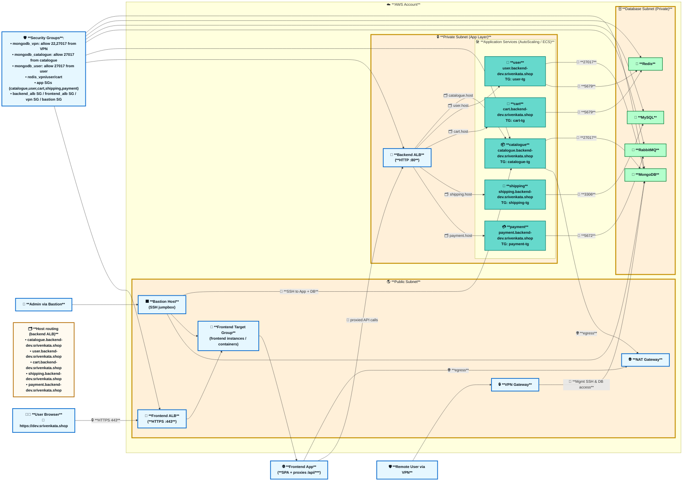

```mermaid
flowchart LR
  %% External Users
  U["🧑‍💻 **User Browser**<br/>🔗 https://dev.srivenkata.shop"]
  V["🛡️ **Remote User via VPN**"]
  BUser["🔑 **Admin via Bastion**"]

  %% AWS Account
  subgraph AWS["☁️ **AWS Account**"]
    direction LR

    %% Public Subnet
    subgraph Public["🌎 **Public Subnet**"]
      direction TB
      Bastion["🟩 **Bastion Host**<br/>(SSH jumpbox)"]
      VPNGW["🔒 **VPN Gateway**"]
      NATG["🌐 **NAT Gateway**"]
      FEALB["🚦 **Frontend ALB**<br/>(**HTTPS :443**)"]
      FETG["🎯 **Frontend Target Group**<br/>(frontend instances / containers)"]
    end

    %% Private Subnet (Apps)
    subgraph Private["🔒 **Private Subnet (App Layer)**"]
      direction TB
      BEALB["🚦 **Backend ALB**<br/>(**HTTP :80**)"]
      subgraph Apps["🛠️ **Application Services (AutoScaling / ECS)**"]
        direction TB
        Catalogue["📦 **catalogue**<br/>catalogue.backend-dev.srivenkata.shop<br/>TG: catalogue-tg"]
        UserSvc["👤 **user**<br/>user.backend-dev.srivenkata.shop<br/>TG: user-tg"]
        Cart["🛒 **cart**<br/>cart.backend-dev.srivenkata.shop<br/>TG: cart-tg"]
        Shipping["🚚 **shipping**<br/>shipping.backend-dev.srivenkata.shop<br/>TG: shipping-tg"]
        Payment["💳 **payment**<br/>payment.backend-dev.srivenkata.shop<br/>TG: payment-tg"]
      end
    end

    %% Database Subnet
    subgraph DB["🗄️ **Database Subnet (Private)**"]
      direction TB
      MongoDB["🍃 **MongoDB**"]
      Redis["🧠 **Redis**"]
      MySQL["🐬 **MySQL**"]
      RabbitMQ["🐇 **RabbitMQ**"]
    end
  end

  %% Frontend App (explicit block so it's highlighted)
  FrontendApp["🌐 **Frontend App**<br/>(**SPA + proxies /api/***)"]

  %% Host rules highlighted box
  HostRules["🗂️ **Host routing (backend ALB)**<br/>• catalogue.backend-dev.srivenkata.shop<br/>• user.backend-dev.srivenkata.shop<br/>• cart.backend-dev.srivenkata.shop<br/>• shipping.backend-dev.srivenkata.shop<br/>• payment.backend-dev.srivenkata.shop"]

  %% Connections / flows
  U -->|🔒 **HTTPS 443**| FEALB
  FEALB --> FETG
  FETG --> FrontendApp
  FrontendApp -->|🔐 proxied API calls| BEALB

  %% Backend ALB routing to services (host-based)
  BEALB -->|🗂️ catalogue.host| Catalogue
  BEALB -->|🗂️ user.host| UserSvc
  BEALB -->|🗂️ cart.host| Cart
  BEALB -->|🗂️ shipping.host| Shipping
  BEALB -->|🗂️ payment.host| Payment

  %% DB connections (ports shown)
  Catalogue -->|🔌 **27017**| MongoDB
  UserSvc -->|🔌 **27017**| MongoDB
  Cart -->|🔌 **5679**| Redis
  UserSvc -->|🔌 **5679**| Redis
  Shipping -->|🔌 **3306**| MySQL
  Payment -->|🔌 **5672**| RabbitMQ

  %% Admin / VPN / Bastion
  V --> VPNGW
  VPNGW -->|🔑 **Mgmt SSH & DB access**| MongoDB
  BUser --> Bastion
  Bastion -->|🔑 **SSH to App + DB**| Catalogue
  Bastion --> FETG
  Bastion --> MongoDB

  %% Egress
  FrontendApp -->|🌐 **egress**| NATG
  Catalogue -->|🌐 **egress**| NATG

  %% Security Group notes (compact)
  SG["🛡️ **Security Groups**:<br/>• mongodb_vpn: allow 22,27017 from VPN<br/>• mongodb_catalogue: allow 27017 from catalogue<br/>• mongodb_user: allow 27017 from user<br/>• redis_vpn/user/cart<br/>• app SGs (catalogue,user,cart,shipping,payment)<br/>• backend_alb SG / frontend_alb SG / vpn SG / bastion SG"]

  SG --> MongoDB
  SG --> Redis
  SG --> MySQL
  SG --> RabbitMQ
  SG --> Catalogue
  SG --> BEALB
  SG --> FEALB

  %% Classes (fixed syntax)
  class Catalogue,UserSvc,Cart,Shipping,Payment appnode;
  class MongoDB,Redis,MySQL,RabbitMQ dbnode;
  class Public,Private,DB subnode;
  class HostRules highlightbox;
  class U,V,BUser,Bastion,VPNGW,NATG,FEALB,FETG,BEALB,FrontendApp,SG highlight;

  %% Definitions (customize once here)
  classDef highlight fill:#e6f7ff,stroke:#0066cc,stroke-width:3px,color:#07111a,font-weight:800;
  classDef appnode fill:#66d9cc,stroke:#007a6b,stroke-width:2px,color:#07111a,font-weight:700;
  classDef dbnode fill:#b3ffcc,stroke:#007a33,stroke-width:2px,color:#07111a,font-weight:700;
  classDef subnode fill:#fff0d9,stroke:#c48f00,stroke-width:4px,color:#07111a;
  classDef highlightbox fill:#fffaf0,stroke:#b36b00,stroke-width:3px,color:#07111a,font-weight:800;

```
