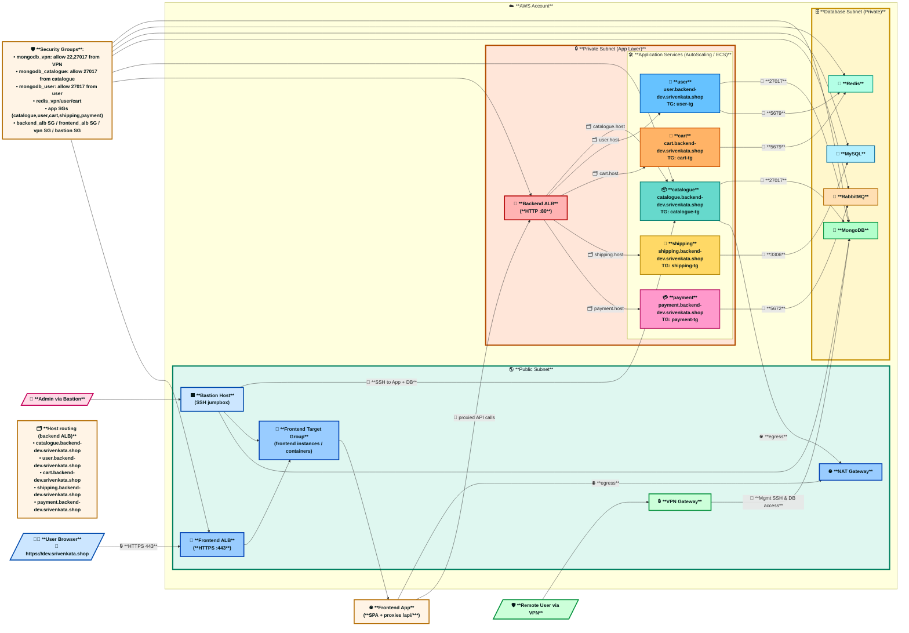

```mermaid
flowchart LR
  %% External Users
  U[/"🧑‍💻 **User Browser**\n🔗 https://dev.srivenkata.shop"/]
  V[/"🛡️ **Remote User via VPN**"/]
  BUser[/"🔑 **Admin via Bastion**"/]

  %% AWS Account
  subgraph AWS["☁️ **AWS Account**"]
    direction LR

    %% Public Subnet
    subgraph Public["🌎 **Public Subnet**"]
      direction TB
      Bastion["🟩 **Bastion Host**\n(SSH jumpbox)"]
      VPNGW["🔒 **VPN Gateway**"]
      NATG["🌐 **NAT Gateway**"]
      FEALB["🚦 **Frontend ALB**\n(**HTTPS :443**)"]
      FETG["🎯 **Frontend Target Group**\n(frontend instances / containers)"]
    end

    %% Private Subnet (Apps)
    subgraph Private["🔒 **Private Subnet (App Layer)**"]
      direction TB
      BEALB["🚦 **Backend ALB**\n(**HTTP :80**)"]
      subgraph Apps["🛠️ **Application Services (AutoScaling / ECS)**"]
        direction TB
        Catalogue["📦 **catalogue**\ncatalogue.backend-dev.srivenkata.shop\nTG: catalogue-tg"]
        UserSvc["👤 **user**\nuser.backend-dev.srivenkata.shop\nTG: user-tg"]
        Cart["🛒 **cart**\ncart.backend-dev.srivenkata.shop\nTG: cart-tg"]
        Shipping["🚚 **shipping**\nshipping.backend-dev.srivenkata.shop\nTG: shipping-tg"]
        Payment["💳 **payment**\npayment.backend-dev.srivenkata.shop\nTG: payment-tg"]
      end
    end

    %% Database Subnet
    subgraph DB["🗄️ **Database Subnet (Private)**"]
      direction TB
      MongoDB["🍃 **MongoDB**"]
      Redis["🧠 **Redis**"]
      MySQL["🐬 **MySQL**"]
      RabbitMQ["🐇 **RabbitMQ**"]
    end
  end

  %% Frontend App highlighted
  FrontendApp["🌐 **Frontend App**\n(**SPA + proxies /api/***)"]

  %% Host rules box
  HostRules["🗂️ **Host routing (backend ALB)**\n• catalogue.backend-dev.srivenkata.shop\n• user.backend-dev.srivenkata.shop\n• cart.backend-dev.srivenkata.shop\n• shipping.backend-dev.srivenkata.shop\n• payment.backend-dev.srivenkata.shop"]

  %% Flows
  U -->|🔒 **HTTPS 443**| FEALB
  FEALB --> FETG
  FETG --> FrontendApp
  FrontendApp -->|🔐 proxied API calls| BEALB

  BEALB -->|🗂️ catalogue.host| Catalogue
  BEALB -->|🗂️ user.host| UserSvc
  BEALB -->|🗂️ cart.host| Cart
  BEALB -->|🗂️ shipping.host| Shipping
  BEALB -->|🗂️ payment.host| Payment

  Catalogue -->|🔌 **27017**| MongoDB
  UserSvc -->|🔌 **27017**| MongoDB
  Cart -->|🔌 **5679**| Redis
  UserSvc -->|🔌 **5679**| Redis
  Shipping -->|🔌 **3306**| MySQL
  Payment -->|🔌 **5672**| RabbitMQ

  V --> VPNGW
  VPNGW -->|🔑 **Mgmt SSH & DB access**| MongoDB
  BUser --> Bastion
  Bastion -->|🔑 **SSH to App + DB**| Catalogue
  Bastion --> FETG
  Bastion --> MongoDB

  FrontendApp -->|🌐 **egress**| NATG
  Catalogue -->|🌐 **egress**| NATG

  SG["🛡️ **Security Groups**:\n• mongodb_vpn: allow 22,27017 from VPN\n• mongodb_catalogue: allow 27017 from catalogue\n• mongodb_user: allow 27017 from user\n• redis_vpn/user/cart\n• app SGs (catalogue,user,cart,shipping,payment)\n• backend_alb SG / frontend_alb SG / vpn SG / bastion SG"]
  SG --> MongoDB
  SG --> Redis
  SG --> MySQL
  SG --> RabbitMQ
  SG --> Catalogue
  SG --> BEALB
  SG --> FEALB

  %% Class definitions - vibrant, high-contrast
  classDef subnet fill:#FFF4E6,stroke:#B36B00,stroke-width:4px,color:#1b1b1b;
  classDef public fill:#DFF7F0,stroke:#008060,stroke-width:4px,color:#07111a;
  classDef private fill:#FFE6D9,stroke:#B34D00,stroke-width:4px,color:#07111a;
  classDef dbSubnet fill:#FFF7CC,stroke:#C48F00,stroke-width:4px,color:#07111a;

  classDef appnode fill:#66D9CC,stroke:#007A6B,stroke-width:2px,color:#041617,font-weight:700;
  classDef app2 fill:#66C2FF,stroke:#0059B3,stroke-width:2px,color:#041617,font-weight:700;
  classDef app3 fill:#FFB366,stroke:#CC5200,stroke-width:2px,color:#041617,font-weight:700;
  classDef app4 fill:#FFD966,stroke:#B38600,stroke-width:2px,color:#041617,font-weight:700;
  classDef app5 fill:#FF99CC,stroke:#B30059,stroke-width:2px,color:#041617,font-weight:700;

  classDef dbnode1 fill:#B3FFCC,stroke:#008F39,stroke-width:2px,color:#041617,font-weight:700;
  classDef dbnode2 fill:#B3FFE6,stroke:#00997A,stroke-width:2px,color:#041617,font-weight:700;
  classDef dbnode3 fill:#B3F0FF,stroke:#006699,stroke-width:2px,color:#041617,font-weight:700;
  classDef dbnode4 fill:#FFDFB3,stroke:#B36B00,stroke-width:2px,color:#041617,font-weight:700;

  classDef userbox fill:#CCE6FF,stroke:#004AAD,stroke-width:3px,color:#041617,font-weight:700;
  classDef bastbox fill:#FFD9E6,stroke:#C4005A,stroke-width:3px,color:#041617,font-weight:700;
  classDef vpnbox fill:#CCFFD9,stroke:#008F39,stroke-width:3px,color:#041617,font-weight:700;
  classDef febox fill:#99CCFF,stroke:#0040B3,stroke-width:3px,color:#041617,font-weight:800;
  classDef bebox fill:#FFB3B3,stroke:#B30000,stroke-width:3px,color:#041617,font-weight:800;
  classDef highlightbox fill:#FFF4E6,stroke:#B36B00,stroke-width:3px,color:#041617,font-weight:800;

  %% Apply classes individually (one line per node to avoid parser issues)
  class Public public;
  class Private private;
  class DB dbSubnet;

  class Catalogue appnode;
  class UserSvc app2;
  class Cart app3;
  class Shipping app4;
  class Payment app5;

  class MongoDB dbnode1;
  class Redis dbnode2;
  class MySQL dbnode3;
  class RabbitMQ dbnode4;

  class U userbox;
  class V vpnbox;
  class BUser bastbox;

  class Bastion userbox;
  class VPNGW vpnbox;
  class NATG febox;
  class FEALB febox;
  class BEALB bebox;
  class FETG febox;

  class FrontendApp highlightbox;
  class HostRules highlightbox;
  class SG highlightbox;


```
