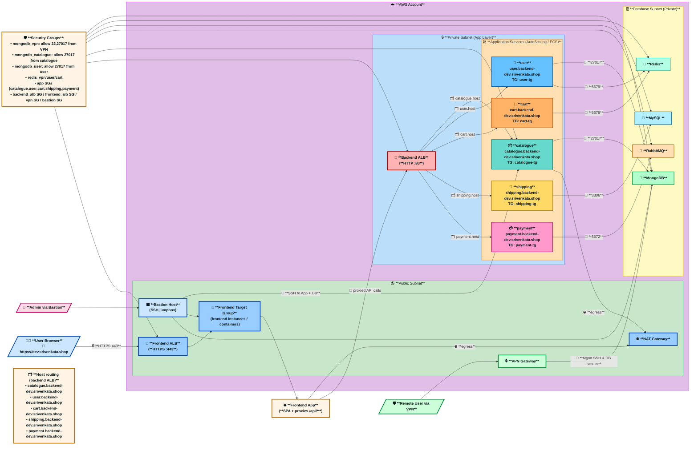

```mermaid
flowchart LR
 subgraph Public["🌎 **Public Subnet**"]
    direction TB
        Bastion["🟩 **Bastion Host**\n(SSH jumpbox)"]
        VPNGW["🔒 **VPN Gateway**"]
        NATG["🌐 **NAT Gateway**"]
        FEALB["🚦 **Frontend ALB**\n(**HTTPS :443**)"]
        FETG["🎯 **Frontend Target Group**\n(frontend instances / containers)"]
  end
 subgraph Apps["🛠️ **Application Services (AutoScaling / ECS)**"]
    direction TB
        Catalogue["📦 **catalogue**\ncatalogue.backend-dev.srivenkata.shop\nTG: catalogue-tg"]
        UserSvc["👤 **user**\nuser.backend-dev.srivenkata.shop\nTG: user-tg"]
        Cart["🛒 **cart**\ncart.backend-dev.srivenkata.shop\nTG: cart-tg"]
        Shipping["🚚 **shipping**\nshipping.backend-dev.srivenkata.shop\nTG: shipping-tg"]
        Payment["💳 **payment**\npayment.backend-dev.srivenkata.shop\nTG: payment-tg"]
  end
 subgraph Private["🔒 **Private Subnet (App Layer)**"]
    direction TB
        BEALB["🚦 **Backend ALB**\n(**HTTP :80**)"]
        Apps
  end
 subgraph DB["🗄️ **Database Subnet (Private)**"]
    direction TB
        MongoDB["🍃 **MongoDB**"]
        Redis["🧠 **Redis**"]
        MySQL["🐬 **MySQL**"]
        RabbitMQ["🐇 **RabbitMQ**"]
  end
 subgraph AWS["☁️ **AWS Account**"]
    direction LR
        Public
        Private
        DB
  end
    U[/"🧑‍💻 **User Browser**\n🔗 https://dev.srivenkata.shop"/] -- 🔒 **HTTPS 443** --> FEALB
    FEALB --> FETG
    FETG --> FrontendApp["🌐 **Frontend App**\n(**SPA + proxies /api/***)"]
    FrontendApp -- 🔐 proxied API calls --> BEALB
    BEALB -- "🗂️ catalogue.host" --> Catalogue
    BEALB -- "🗂️ user.host" --> UserSvc
    BEALB -- "🗂️ cart.host" --> Cart
    BEALB -- "🗂️ shipping.host" --> Shipping
    BEALB -- "🗂️ payment.host" --> Payment
    Catalogue -- 🔌 **27017** --> MongoDB
    UserSvc -- 🔌 **27017** --> MongoDB
    Cart -- 🔌 **5679** --> Redis
    UserSvc -- 🔌 **5679** --> Redis
    Shipping -- 🔌 **3306** --> MySQL
    Payment -- 🔌 **5672** --> RabbitMQ
    V[/"🛡️ **Remote User via VPN**"/] --> VPNGW
    VPNGW -- 🔑 **Mgmt SSH & DB access** --> MongoDB
    BUser[/"🔑 **Admin via Bastion**"/] --> Bastion
    Bastion -- 🔑 **SSH to App + DB** --> Catalogue
    Bastion --> FETG & MongoDB
    FrontendApp -- 🌐 **egress** --> NATG
    Catalogue -- 🌐 **egress** --> NATG
    SG["🛡️ **Security Groups**:\n• mongodb_vpn: allow 22,27017 from VPN\n• mongodb_catalogue: allow 27017 from catalogue\n• mongodb_user: allow 27017 from user\n• redis_vpn/user/cart\n• app SGs (catalogue,user,cart,shipping,payment)\n• backend_alb SG / frontend_alb SG / vpn SG / bastion SG"] --> MongoDB & Redis & MySQL & RabbitMQ & Catalogue & BEALB & FEALB
    HostRules["🗂️ **Host routing (backend ALB)**\n• catalogue.backend-dev.srivenkata.shop\n• user.backend-dev.srivenkata.shop\n• cart.backend-dev.srivenkata.shop\n• shipping.backend-dev.srivenkata.shop\n• payment.backend-dev.srivenkata.shop"]

     Bastion:::userbox
     VPNGW:::vpnbox
     NATG:::febox
     FEALB:::febox
     FETG:::febox
     Catalogue:::appnode
     UserSvc:::app2
     Cart:::app3
     Shipping:::app4
     Payment:::app5
     BEALB:::bebox
     MongoDB:::dbnode1
     Redis:::dbnode2
     MySQL:::dbnode3
     RabbitMQ:::dbnode4
     U:::userbox
     FrontendApp:::highlightbox
     V:::vpnbox
     BUser:::bastbox
     SG:::highlightbox
     HostRules:::highlightbox
    classDef subnet fill:#FFF4E6,stroke:#B36B00,stroke-width:4px,color:#1b1b1b
    classDef public fill:#DFF7F0,stroke:#008060,stroke-width:4px,color:#07111a
    classDef private fill:#FFE6D9,stroke:#B34D00,stroke-width:4px,color:#07111a
    classDef dbSubnet fill:#FFF7CC,stroke:#C48F00,stroke-width:4px,color:#07111a
    classDef appnode fill:#66D9CC,stroke:#007A6B,stroke-width:2px,color:#041617,font-weight:700
    classDef app2 fill:#66C2FF,stroke:#0059B3,stroke-width:2px,color:#041617,font-weight:700
    classDef app3 fill:#FFB366,stroke:#CC5200,stroke-width:2px,color:#041617,font-weight:700
    classDef app4 fill:#FFD966,stroke:#B38600,stroke-width:2px,color:#041617,font-weight:700
    classDef app5 fill:#FF99CC,stroke:#B30059,stroke-width:2px,color:#041617,font-weight:700
    classDef dbnode1 fill:#B3FFCC,stroke:#008F39,stroke-width:2px,color:#041617,font-weight:700
    classDef dbnode2 fill:#B3FFE6,stroke:#00997A,stroke-width:2px,color:#041617,font-weight:700
    classDef dbnode3 fill:#B3F0FF,stroke:#006699,stroke-width:2px,color:#041617,font-weight:700
    classDef dbnode4 fill:#FFDFB3,stroke:#B36B00,stroke-width:2px,color:#041617,font-weight:700
    classDef userbox fill:#CCE6FF,stroke:#004AAD,stroke-width:3px,color:#041617,font-weight:700
    classDef bastbox fill:#FFD9E6,stroke:#C4005A,stroke-width:3px,color:#041617,font-weight:700
    classDef vpnbox fill:#CCFFD9,stroke:#008F39,stroke-width:3px,color:#041617,font-weight:700
    classDef febox fill:#99CCFF,stroke:#0040B3,stroke-width:3px,color:#041617,font-weight:800
    classDef bebox fill:#FFB3B3,stroke:#B30000,stroke-width:3px,color:#041617,font-weight:800
    classDef highlightbox fill:#FFF4E6,stroke:#B36B00,stroke-width:3px,color:#041617,font-weight:800
    style Apps stroke:#FF6D00,fill:#FFE0B2
    style Public stroke:#00C853,fill:#C8E6C9,color:#000000
    style Private stroke:#2962FF,fill:#BBDEFB
    style DB stroke:#FFD600,fill:#FFF9C4,color:#000000
    style AWS fill:#E1BEE7,stroke:#AA00FF,color:#000000


```
