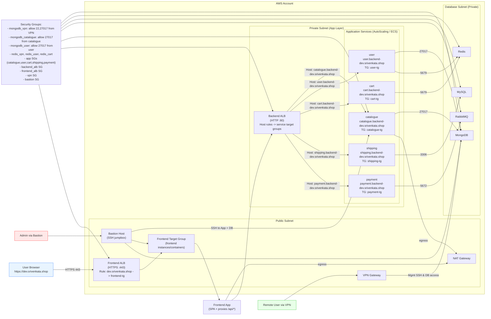

# roboshop-infra-dev

```mermaid

flowchart LR
  %% External Users
  UserBrowser["User Browser<br>https://dev.srivenkata.shop"]
  VPN_User["Remote User via VPN"]
  Bastion_User["Admin via Bastion"]

  %% AWS Account
  subgraph AWS_Account["AWS Account"]
    direction LR

    %% Public Subnet
    subgraph Public_Subnet["Public Subnet"]
      direction TB
      Bastion["Bastion Host<br>(SSH jumpbox)"]
      VPN["VPN Gateway"]
      NAT["NAT Gateway"]
      FE_ALB["Frontend ALB<br>(HTTPS :443)<br>Rule: dev.srivenkata.shop -> frontend-tg"]
      Frontend_TG["Frontend Target Group<br>(frontend instances/containers)"]
    end

    %% Private Subnet (Apps)
    subgraph Private_Subnet["Private Subnet (App Layer)"]
      direction TB
      BE_ALB["Backend ALB<br>(HTTP :80)<br>Host rules -> service target groups"]
      subgraph Services["Application Services (AutoScaling / ECS)"]
        direction TB
        Catalogue["catalogue<br>catalogue.backend-dev.srivenkata.shop<br>TG: catalogue-tg"]
        User["user<br>user.backend-dev.srivenkata.shop<br>TG: user-tg"]
        Cart["cart<br>cart.backend-dev.srivenkata.shop<br>TG: cart-tg"]
        Shipping["shipping<br>shipping.backend-dev.srivenkata.shop<br>TG: shipping-tg"]
        Payment["payment<br>payment.backend-dev.srivenkata.shop<br>TG: payment-tg"]
      end
    end

    %% Database Subnet
    subgraph DB_Subnet["Database Subnet (Private)"]
      direction TB
      MongoDB["MongoDB"]
      Redis["Redis"]
      MySQL["MySQL"]
      RabbitMQ["RabbitMQ"]
    end

  end

  %% User traffic flow
  UserBrowser -->|HTTPS 443| FE_ALB
  FE_ALB --> Frontend_TG
  Frontend_TG --> Frontend_App["Frontend App<br>(SPA + proxies /api/*)"]
  Frontend_App --> BE_ALB

  %% Backend ALB routing
  BE_ALB -->|Host: catalogue.backend-dev.srivenkata.shop| Catalogue
  BE_ALB -->|Host: user.backend-dev.srivenkata.shop| User
  BE_ALB -->|Host: cart.backend-dev.srivenkata.shop| Cart
  BE_ALB -->|Host: shipping.backend-dev.srivenkata.shop| Shipping
  BE_ALB -->|Host: payment.backend-dev.srivenkata.shop| Payment

  %% Service to DB connections
  Catalogue -->|27017| MongoDB
  User -->|27017| MongoDB
  Cart -->|5679| Redis
  User -->|5679| Redis
  Shipping -->|3306| MySQL
  Payment -->|5672| RabbitMQ

  %% Admin access
  VPN_User --> VPN
  VPN -->|Mgmt SSH & DB access| MongoDB
  Bastion_User --> Bastion
  Bastion -->|SSH to App + DB| Catalogue
  Bastion --> Frontend_TG
  Bastion --> MongoDB

  %% Internet egress
  Frontend_App -->|egress| NAT
  Catalogue -->|egress| NAT

  %% Security Group Notes
  SG_Notes["Security Groups:<br>- mongodb_vpn: allow 22,27017 from VPN<br>- mongodb_catalogue: allow 27017 from catalogue<br>- mongodb_user: allow 27017 from user<br>- redis_vpn, redis_user, redis_cart<br>- app SGs (catalogue,user,cart,shipping,payment)<br>- backend_alb SG<br>- frontend_alb SG<br>- vpn SG<br>- bastion SG"]
  SG_Notes --> MongoDB
  SG_Notes --> Redis
  SG_Notes --> MySQL
  SG_Notes --> RabbitMQ
  SG_Notes --> Catalogue
  SG_Notes --> BE_ALB
  SG_Notes --> FE_ALB

  %% Styling
  style UserBrowser fill:#e8f4ff,stroke:#2b7cff
  style VPN_User fill:#e8ffe8,stroke:#2bbf2b
  style Bastion_User fill:#ffe8e8,stroke:#ff2b2b

```
