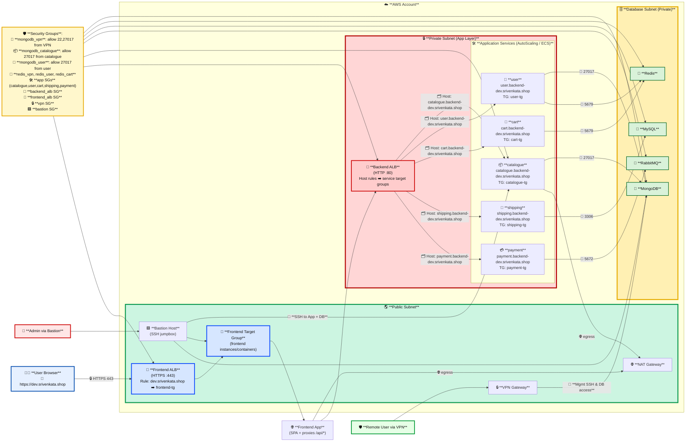

# roboshop-infra-dev

```mermaid

flowchart LR
  %% 🌐 External Users
  UserBrowser["🧑‍💻 **User Browser**<br>🔗 https://dev.srivenkata.shop"]
  VPN_User["🛡️ **Remote User via VPN**"]
  Bastion_User["🔑 **Admin via Bastion**"]

  %% ☁️ AWS Account
  subgraph AWS_Account["☁️ **AWS Account**"]
    direction LR

    %% 🌎 Public Subnet
    subgraph Public_Subnet["🌎 **Public Subnet**"]
      direction TB
      Bastion["🟩 **Bastion Host**<br>(SSH jumpbox)"]
      VPN["🔒 **VPN Gateway**"]
      NAT["🌐 **NAT Gateway**"]
      FE_ALB["🚦 **Frontend ALB**<br>(HTTPS :443)<br>Rule: dev.srivenkata.shop ➡️ frontend-tg"]
      Frontend_TG["🎯 **Frontend Target Group**<br>(frontend instances/containers)"]
    end

    %% 🔒 Private Subnet (Apps)
    subgraph Private_Subnet["🔒 **Private Subnet (App Layer)**"]
      direction TB
      BE_ALB["🚦 **Backend ALB**<br>(HTTP :80)<br>Host rules ➡️ service target groups"]
      subgraph Services["🛠️ **Application Services (AutoScaling / ECS)**"]
        direction TB
        Catalogue["📦 **catalogue**<br>catalogue.backend-dev.srivenkata.shop<br>TG: catalogue-tg"]
        User["👤 **user**<br>user.backend-dev.srivenkata.shop<br>TG: user-tg"]
        Cart["🛒 **cart**<br>cart.backend-dev.srivenkata.shop<br>TG: cart-tg"]
        Shipping["🚚 **shipping**<br>shipping.backend-dev.srivenkata.shop<br>TG: shipping-tg"]
        Payment["💳 **payment**<br>payment.backend-dev.srivenkata.shop<br>TG: payment-tg"]
      end
    end

    %% 🗄️ Database Subnet
    subgraph DB_Subnet["🗄️ **Database Subnet (Private)**"]
      direction TB
      MongoDB["🍃 **MongoDB**"]
      Redis["🧠 **Redis**"]
      MySQL["🐬 **MySQL**"]
      RabbitMQ["🐇 **RabbitMQ**"]
    end

  end

  %% 🔁 User traffic flow
  UserBrowser -->|🔒 HTTPS 443| FE_ALB
  FE_ALB --> Frontend_TG
  Frontend_TG --> Frontend_App["🌐 **Frontend App**<br>(SPA + proxies /api/*)"]
  Frontend_App --> BE_ALB

  %% 🛣️ Backend ALB routing
  BE_ALB -->|🗂️ Host: catalogue.backend-dev.srivenkata.shop| Catalogue
  BE_ALB -->|🗂️ Host: user.backend-dev.srivenkata.shop| User
  BE_ALB -->|🗂️ Host: cart.backend-dev.srivenkata.shop| Cart
  BE_ALB -->|🗂️ Host: shipping.backend-dev.srivenkata.shop| Shipping
  BE_ALB -->|🗂️ Host: payment.backend-dev.srivenkata.shop| Payment

  %% 🔗 Service to DB connections
  Catalogue -->|🔌 27017| MongoDB
  User -->|🔌 27017| MongoDB
  Cart -->|🔌 5679| Redis
  User -->|🔌 5679| Redis
  Shipping -->|🔌 3306| MySQL
  Payment -->|🔌 5672| RabbitMQ

  %% 🛡️ Admin access
  VPN_User --> VPN
  VPN -->|🔑 **Mgmt SSH & DB access**| MongoDB
  Bastion_User --> Bastion
  Bastion -->|🔑 **SSH to App + DB**| Catalogue
  Bastion --> Frontend_TG
  Bastion --> MongoDB

  %% 🌍 Internet egress
  Frontend_App -->|🌐 egress| NAT
  Catalogue -->|🌐 egress| NAT

  %% 🛡️ Security Group Notes
  SG_Notes["🛡️ **Security Groups**:<br>🍃 **mongodb_vpn**: allow 22,27017 from VPN<br>📦 **mongodb_catalogue**: allow 27017 from catalogue<br>👤 **mongodb_user**: allow 27017 from user<br>🧠 **redis_vpn, redis_user, redis_cart**<br>🛠️ **app SGs** (catalogue,user,cart,shipping,payment)<br>🚦 **backend_alb SG**<br>🚦 **frontend_alb SG**<br>🔒 **vpn SG**<br>🟩 **bastion SG**"]
  SG_Notes --> MongoDB
  SG_Notes --> Redis
  SG_Notes --> MySQL
  SG_Notes --> RabbitMQ
  SG_Notes --> Catalogue
  SG_Notes --> BE_ALB
  SG_Notes --> FE_ALB

  %% 🎨 Styling for contrast and readability
  style UserBrowser fill:#e6f0ff,stroke:#004aad,stroke-width:3px,color:#111
  style VPN_User fill:#e6ffe6,stroke:#009933,stroke-width:3px,color:#111
  style Bastion_User fill:#ffe6e6,stroke:#cc0000,stroke-width:3px,color:#111

  style Public_Subnet fill:#ccf5e1,stroke:#0d9950,stroke-width:4px,color:#111
  style Private_Subnet fill:#ffd6d6,stroke:#b30000,stroke-width:4px,color:#111
  style DB_Subnet fill:#fff0b3,stroke:#e6ac00,stroke-width:4px,color:#111

  style FE_ALB fill:#d6e6ff,stroke:#0040ff,stroke-width:3px,color:#111
  style BE_ALB fill:#ffcccc,stroke:#cc0000,stroke-width:3px,color:#111
  style Frontend_TG fill:#d6e6ff,stroke:#0040ff,stroke-width:3px,color:#111

  style MongoDB fill:#d9f2d9,stroke:#006622,stroke-width:2px,color:#111
  style Redis fill:#d9f2d9,stroke:#006622,stroke-width:2px,color:#111
  style MySQL fill:#d9f2d9,stroke:#006622,stroke-width:2px,color:#111
  style RabbitMQ fill:#d9f2d9,stroke:#006622,stroke-width:2px,color:#111

  style SG_Notes fill:#fff7cc,stroke:#e6a800,stroke-width:3px,color:#111
```
