# Roboshop Infra Dev – Complete Cloud-Native Architecture

Welcome to the **Roboshop Infra Dev** repository!  
This project demonstrates a real-world, production-grade, multi-tier microservices architecture on AWS, using **Terraform** for infrastructure-as-code and **Ansible** for configuration management.

---

## 🚀 **Project Overview**

Roboshop is a cloud-native e-commerce platform, built with best practices for security, scalability, and automation.  
The architecture includes:

- **VPC, Subnets, Security Groups**
- **Bastion Host & VPN Gateway**
- **Application Load Balancers (Frontend & Backend)**
- **Auto-scaling Application Services (ECS/EC2)**
- **Databases (MongoDB, MySQL, Redis, RabbitMQ)**
- **CloudFront CDN for global delivery**
- **ACM for SSL/TLS**
- **Automated provisioning with Ansible-pull**

---

## 🗂️ **Folder Structure & Modules**

| Folder                | Purpose / Module Description                                                                 |
|-----------------------|---------------------------------------------------------------------------------------------|
| `00-vpc/`             | VPC, subnets, peering, and networking basics                                               |
| `10-sg/`              | Security groups for every layer and service                                                |
| `20-bastin/`          | Bastion host for secure SSH access                                                         |
| `30-vpn/`             | VPN Gateway for secure remote access                                                       |
| `40-databases/`       | Database instances and security                                                            |
| `50-backend-alb/`     | Backend Application Load Balancer                                                          |
| `60-acm/`             | ACM certificate provisioning for HTTPS                                                     |
| `60-catalogue/`       | Catalogue microservice (with Ansible provisioning)                                         |
| `70-frontend-alb/`    | Frontend Application Load Balancer                                                         |
| `80-user/`            | User microservice                                                                          |
| `90-components/`      | Other microservices (cart, shipping, payment, etc.)                                        |
| `91-cdn/`             | CloudFront CDN configuration                                                               |
| `rolesAnsibleRoboshop-tf/` | Ansible roles for all microservices, including inventory and playbooks                |
| `terraform-aws-*`     | Standalone reusable Terraform modules (VPC, Security Group, Instance, etc.)                |
| `roboshop-ec2-test/`  | EC2 test environment for quick validation                                                  |
| `terraform-multi-env/`| Multi-environment (dev/prod) workspace examples                                            |
| `mahaTerraform/`      | Advanced Terraform patterns (loops, functions, datasources, etc.)                          |

---

## 🛠️ **How It Works**

- **Terraform** provisions all AWS resources, using modules for reusability and clarity.
- **Ansible-pull** is used for configuration management on each EC2 instance, triggered via user-data scripts.
- **CloudFront CDN** accelerates global delivery and secures the frontend.
- **ACM** provides SSL certificates for secure HTTPS endpoints.
- **Security Groups** are tightly managed for least-privilege access between all layers.
- **Bastion & VPN** provide secure admin and remote access.

---

## 🔗 **Connection Between Components**

- **User traffic** flows from CloudFront CDN → Frontend ALB → Frontend App → Backend ALB → Microservices.
- **Microservices** connect to databases (MongoDB, MySQL, Redis, RabbitMQ) in private subnets.
- **Admins** connect via Bastion or VPN for management.
- **Security Groups** enforce strict access rules between all components.

See the [Mermaid diagram](#architecture-diagram) below for a visual overview.

---

## 📝 **Common Errors & Lessons Learned**

- **Security Group Not Found:**  
  Make sure SG IDs are created in the correct VPC and referenced properly.
- **SSM Parameter Already Exists:**  
  Use `overwrite = true` in Terraform for SSM parameters.
- **CloudFront Origin Domain Error:**  
  Always use the actual backend DNS name (ALB/S3/EC2), not a CNAME or wildcard.
- **ACM Certificate Mismatch:**  
  ACM must cover all CloudFront aliases (CNAMEs).
- **Ansible-pull Not Found:**  
  Ensure Ansible is installed via OS package manager and run under a login shell.
- **RabbitMQ Service Fails:**  
  Install Erlang before RabbitMQ; check logs for missing dependencies.

---

## 🏃 **How to Run**

1. **Clone the repo:**
   ```sh
   git clone https://github.com/MAHALAKSHMImahalakshmi/roboshop-infra-dev.git
   cd roboshop-infra-dev
   ```

2. **Initialize Terraform:**
   ```sh
   terraform init
   ```

3. **Apply infrastructure (per module):**
   ```sh
   terraform apply -auto-approve
   ```

4. **Provision EC2 instances:**
   - User-data scripts trigger `ansible-pull` on boot.
   - Ansible roles are fetched from `rolesAnsibleRoboshop-tf/`.

5. **Access the app:**
   - Frontend: `https://dev.srivenkata.shop` (via CloudFront CDN)
   - Admin: SSH via Bastion or connect via VPN

---

## 🔒 **Security Best Practices**

- All secrets (DB passwords, tokens) are stored in AWS SSM Parameter Store or Vault.
- Security groups restrict access to only necessary ports and sources.
- Bastion and VPN are required for admin/database access.
- ACM certificates enforce HTTPS everywhere.

---

## 📦 **Ansible-Pull & Automation**

- Each microservice EC2 instance runs a user-data script:
  ```sh
  ansible-pull -U https://github.com/MAHALAKSHMImahalakshmi/rolesAnsibleRoboshop-tf.git -e component=<service> -e env=dev main.yaml
  ```
- Roles are modular and reusable for all services.
- Configuration is idempotent and self-healing.

---

## 🖼️ **Architecture Diagram**

```mermaid
flowchart LR
  %% CDN Layer
  subgraph CDN["🛰️ **CloudFront CDN**"]
    direction TB
    CDNDist["🛰️ **CloudFront Distribution**<br>cdn.srivenkata.shop"]
  end
  subgraph Public["🌎 **Public Subnet**"]
    direction TB
    Bastion["🟩 **Bastion Host**\n(SSH jumpbox)"]
    VPNGW["🔒 **VPN Gateway**"]
    NATG["🌐 **NAT Gateway**"]
    FEALB["🚦 **Frontend ALB**\n(**HTTPS :443**)"]
    FETG["🎯 **Frontend Target Group**\n(frontend instances / containers)"]
  end
  subgraph Apps["🛠️ **Application Services (AutoScaling / ECS)**"]
    direction TB
    Catalogue["📦 **catalogue**\ncatalogue.backend-dev.srivenkata.shop\nTG: catalogue-tg"]
    UserSvc["👤 **user**\nuser.backend-dev.srivenkata.shop\nTG: user-tg"]
    Cart["🛒 **cart**\ncart.backend-dev.srivenkata.shop\nTG: cart-tg"]
    Shipping["🚚 **shipping**\nshipping.backend-dev.srivenkata.shop\nTG: shipping-tg"]
    Payment["💳 **payment**\npayment.backend-dev.srivenkata.shop\nTG: payment-tg"]
  end
  subgraph Private["🔒 **Private Subnet (App Layer)**"]
    direction TB
    BEALB["🚦 **Backend ALB**\n(**HTTP :80**)"]
    Apps
  end
  subgraph DB["🗄️ **Database Subnet (Private)**"]
    direction TB
    MongoDB["🍃 **MongoDB**"]
    Redis["🧠 **Redis**"]
    MySQL["🐬 **MySQL**"]
    RabbitMQ["🐇 **RabbitMQ**"]
  end
  subgraph AWS["☁️ **AWS Account**"]
    direction LR
    CDN
    Public
    Private
    DB
  end
  U[/"🧑‍💻 **User Browser**\n🔗 https://dev.srivenkata.shop"/] -- 🔒 **HTTPS 443** --> CDNDist
  CDNDist -- 🔒 **HTTPS 443** --> FEALB
  FEALB --> FETG
  FETG --> FrontendApp["🌐 **Frontend App**\n(**SPA + proxies /api/***)"]
  FrontendApp -- 🔐 proxied API calls --> BEALB
  BEALB -- "🗂️ catalogue.host" --> Catalogue
  BEALB -- "🗂️ user.host" --> UserSvc
  BEALB -- "🗂️ cart.host" --> Cart
  BEALB -- "🗂️ shipping.host" --> Shipping
  BEALB -- "🗂️ payment.host" --> Payment
  Catalogue -- 🔌 **27017** --> MongoDB
  UserSvc -- 🔌 **27017** --> MongoDB
  Cart -- 🔌 **5679** --> Redis
  UserSvc -- 🔌 **5679** --> Redis
  Shipping -- 🔌 **3306** --> MySQL
  Payment -- 🔌 **5672** --> RabbitMQ
  V[/"🛡️ **Remote User via VPN**"/] --> VPNGW
  VPNGW -- 🔑 **Mgmt SSH & DB access** --> MongoDB
  BUser[/"🔑 **Admin via Bastion**"/] --> Bastion
  Bastion -- 🔑 **SSH to App + DB** --> Catalogue
  Bastion --> FETG
  Bastion --> MongoDB
  FrontendApp -- 🌐 **egress** --> NATG
  Catalogue -- 🌐 **egress** --> NATG
  SG["🛡️ **Security Groups**:\n• mongodb_vpn: allow 22,27017 from VPN\n• mongodb_catalogue: allow 27017 from catalogue\n• mongodb_user: allow 27017 from user\n• redis_vpn/user/cart\n• app SGs (catalogue,user,cart,shipping,payment)\n• backend_alb SG / frontend_alb SG / vpn SG / bastion SG"] --> MongoDB
  SG --> Redis
  SG --> MySQL
  SG --> RabbitMQ
  SG --> Catalogue
  SG --> BEALB
  SG --> FEALB
  HostRules["🗂️ **Host routing (backend ALB)**\n• catalogue.backend-dev.srivenkata.shop\n• user.backend-dev.srivenkata.shop\n• cart.backend-dev.srivenkata.shop\n• shipping.backend-dev.srivenkata.shop\n• payment.backend-dev.srivenkata.shop"]
  Bastion:::userbox
  VPNGW:::vpnbox
  NATG:::febox
  FEALB:::febox
  FETG:::febox
  CDNDist:::cdnbox
  Catalogue:::appnode
  UserSvc:::app2
  Cart:::app3
  Shipping:::app4
  Payment:::app5
  BEALB:::bebox
  MongoDB:::dbnode1
  Redis:::dbnode2
  MySQL:::dbnode3
  RabbitMQ:::dbnode4
  U:::userbox
  FrontendApp:::highlightbox
  V:::vpnbox
  BUser:::bastbox
  SG:::highlightbox
  HostRules:::highlightbox
  classDef cdnbox fill:#222,stroke:#fff,stroke-width:3px,color:#fff,font-weight:800
  classDef subnet fill:#FFF4E6,stroke:#B36B00,stroke-width:4px,color:#1b1b1b
  classDef public fill:#DFF7F0,stroke:#008060,stroke-width:4px,color:#07111a
  classDef private fill:#FFE6D9,stroke:#B34D00,stroke-width:4px,color:#07111a
  classDef dbSubnet fill:#FFF7CC,stroke:#C48F00,stroke-width:4px,color:#07111a
  classDef appnode fill:#66D9CC,stroke:#007A6B,stroke-width:2px,color:#041617,font-weight:700
  classDef app2 fill:#66C2FF,stroke:#0059B3,stroke-width:2px,color:#041617,font-weight:700
  classDef app3 fill:#FFB366,stroke:#CC5200,stroke-width:2px,color:#041617,font-weight:700
  classDef app4 fill:#FFD966,stroke:#B38600,stroke-width:2px,color:#041617,font-weight:700
  classDef app5 fill:#FF99CC,stroke:#B30059,stroke-width:2px,color:#041617,font-weight:700
  classDef dbnode1 fill:#B3FFCC,stroke:#008F39,stroke-width:2px,color:#041617,font-weight:700
  classDef dbnode2 fill:#B3FFE6,stroke:#00997A,stroke-width:2px,color:#041617,font-weight:700
  classDef dbnode3 fill:#B3F0FF,stroke:#006699,stroke-width:2px,color:#041617,font-weight:700
  classDef dbnode4 fill:#FFDFB3,stroke:#B36B00,stroke-width:2px,color:#041617,font-weight:700
  classDef userbox fill:#CCE6FF,stroke:#004AAD,stroke-width:3px,color:#041617,font-weight:700
  classDef bastbox fill:#FFD9E6,stroke:#C4005A,stroke-width:3px,color:#041617,font-weight:700
  classDef vpnbox fill:#CCFFD9,stroke:#008F39,stroke-width:3px,color:#041617,font-weight:700
  classDef febox fill:#99CCFF,stroke:#0040B3,stroke-width:3px,color:#041617,font-weight:800
  classDef bebox fill:#FFB3B3,stroke:#B30000,stroke-width:3px,color:#041617,font-weight:800
  classDef highlightbox fill:#FFF4E6,stroke:#B36B00,stroke-width:3px,color:#041617,font-weight:800
  style Apps stroke:#FF6D00,fill:#FFE0B2
  style Public stroke:#00C853,fill:#C8E6C9,color:#000000
  style Private stroke:#2962FF,fill:#BBDEFB
  style DB stroke:#FFD600,fill:#FFF9C4,color:#000000
  style AWS fill:#E1BEE7,stroke:#AA00FF,color:#000000
  linkStyle default stroke:#000,stroke-width:2px
```



---

## 💡 **Why This Matters**

This repo is a example of how to build, automate, and secure cloud-native microservices on AWS.  
Every folder, module, and script is designed for clarity, reusability, and real-world reliability.

---

## 🙏 **Contributions & Feedback**

Feel free to open issues or PRs for improvements, bug fixes, or new features.  
If you get stuck, check the error notes above or reach out via GitHub Issues.

---

**Happy Cloud Building!**
